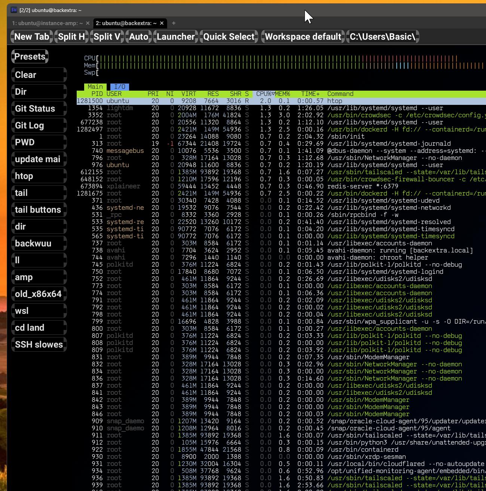

# wezterm-buttons

A modified build of [WezTerm](https://wezterm.org/) with a custom left dock and top bar, both filled with clickable buttons. You can set them to commands/things to type, if you are often typing out long commands.. and you hate keyboard combos.



## What's different

- **Left dock** — a panel on the left side with preset SSH/command buttons. Click a button to send its command to the active terminal.
- **Top bar** — a strip above the tab bar with action buttons (New Tab, Split, Launcher, etc.) and a workspace/path context pill.
- Both panels are configurable via a TOML file at `%APPDATA%\wezterm\w111erd_presets.toml`. See `w111erd_presets_example.toml` for all options including `panel_font_size`.

## Building

```
cargo build --release -p wezterm-gui
```

Output: `target\release\wezterm-gui.exe`

## Original project

WezTerm is a GPU-accelerated cross-platform terminal emulator written by [@wez](https://github.com/wez) in Rust.
Upstream source and docs: https://wezterm.org/

If you use and like WezTerm, please consider sponsoring it: your support helps
to cover the fees required to maintain the project and to validate the time
spent working on it!

[Read more about sponsoring](https://wezterm.org/sponsor.html).

- [](https://github.com/sponsors/wez)
- [Patreon](https://patreon.com/WezFurlong)
- [Ko-Fi](https://ko-fi.com/wezfurlong)
- [Liberapay](https://liberapay.com/wez)
